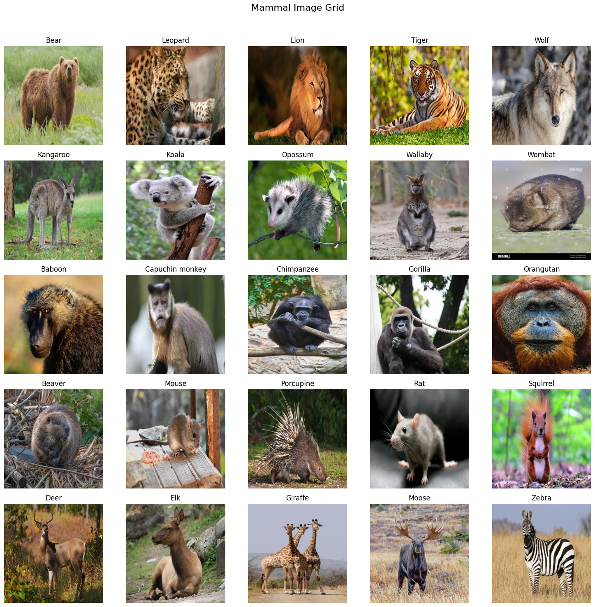

# Mammal-Type-Classifier

This repository contains a mammal type classifier built using a pretrained neural network. The classifier can identify and categorize mammals into five primary groups: primates, rodents, ungulates, carnivores, and marsupials.



## Overview

In this solo project, I:

1. **Data Collection and Preprocessing**: Curated a dataset of around 100 images per mammal type from DuckDuckGo image search.

2. **Model Fine-Tuning**: Fine-tuned a pretrained neural network to recognize distinct features for each mammal group.

3. **Performance Evaluation**: Assessed the classifier's accuracy and generalization on new images.

## Usage

1. Clone this repository:
```
git clone https://github.com/RogerA11/Mammal-Type-Classifier.git
```

2. Navigate to the repository:
```
cd Mammal-Type-Classifier
```

3. Open and run `mammaltypeclassifier.ipynb` to explore the project details.

## Contact

For questions or collaboration, reach out to me via GitHub or email at roger.arendse713@gmail.com

Thank you for your interest in the Mammal-Type-Classifier project!
