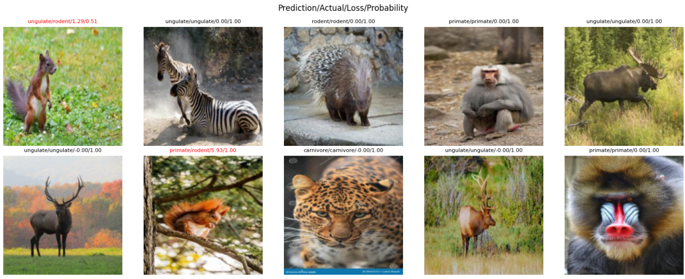
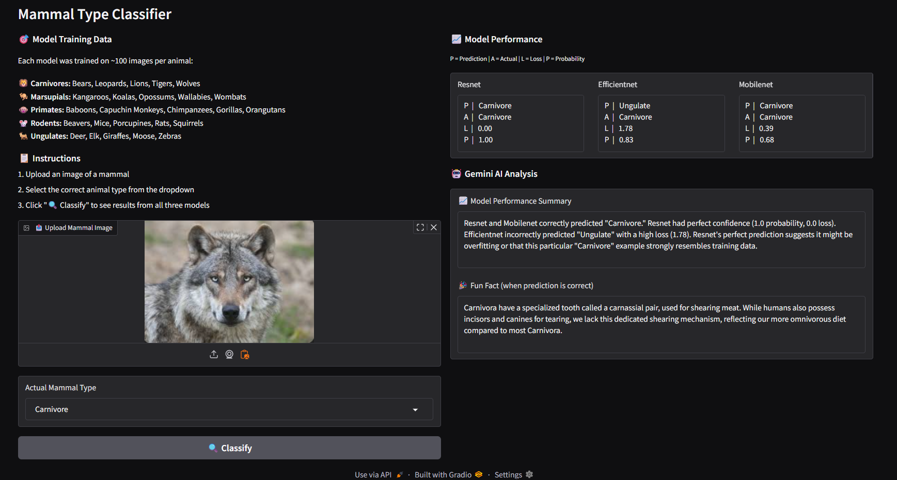

# Mammal Type Classifier

An end-to-end machine learning project that classifies mammal images into five primary groups using computer vision. The project demonstrates the complete ML pipeline from data collection to deployment via an interactive web application.



## 🎯 Project Overview

This classifier identifies mammals across five major taxonomic groups:
- **Carnivores**: Bears, Leopards, Lions, Tigers, Wolves
- **Marsupials**: Kangaroos, Koalas, Opossums, Wallabies, Wombats  
- **Primates**: Baboons, Capuchin Monkeys, Chimpanzees, Gorillas, Orangutans
- **Rodents**: Beavers, Mice, Porcupines, Rats, Squirrels
- **Ungulates**: Deer, Elk, Giraffes, Moose, Zebras

## 🚀 Quick Start

### Prerequisites
```bash
pip install -r requirements.txt
```

### Gemini API Setup
1. Get your free Gemini API key from [Google AI Studio](https://aistudio.google.com/app/apikey)
2. Set your API key as an environment variable:
  ```bash
  export GEMINI_API_KEY="your-api-key-here"
  ```
    Note: Never commit API keys to version control. Consider using a .env file and ensure it's added to your .gitignore

### Run the Application
```bash
python app.py
```

The Gradio interface will launch at `http://localhost:7860`



## 📊 Model Performance

Three pre-trained CNN architectures were fine-tuned and compared:

| Model | Architecture | Performance Highlights |
|-------|-------------|----------------------|
| **ResNet** | Residual Network | Strong confidence with accurate predictions |
| **EfficientNet** | Compound Scaling | High loss despite good probability scores |
| **MobileNet** | Depthwise Separable Convolutions | Balanced uncertainty reflection |

*Based on carnivore classification example: Only ResNet correctly predicted "Carnivore" with high confidence, while EfficientNet showed high loss (29.26) despite 1.0 probability, and MobileNet's lower probability (0.55) better reflected prediction uncertainty.*

## 🛠️ Project Structure

```
Mammal-Type-Classifier/
├── app/
│   ├── models/                    # Trained model files (.pkl)
│   ├── app.py                     # Gradio application
│   └── requirements.txt           # Dependencies
├── model/
│   ├── dataset/
│   │   ├── train/                 # Training images by category
│   │   └── val/                   # Validation images by category
│   ├── mammaltypeclassifier.ipynb # Model training notebook
│   └── utils/
└── README.md
```

## 🔄 Workflow

### 1. Data Collection
- Automated image scraping from DuckDuckGo search results
- ~100 images per animal species collected
- Organized into structured train/validation datasets

### 2. Model Training  
- Fine-tuned three pre-trained CNN architectures
- Comparative analysis of model performance
- Evaluated on accuracy and prediction confidence

### 3. Deployment
- Interactive Gradio web application
- Multi-model comparison interface
- AI-generated fun facts via Gemini LLM integration

## 🌟 Features

- **Multi-Model Comparison**: Test the same image across all three models
- **Performance Analytics**: View detailed prediction metrics
- **Educational Content**: AI-generated animal facts for correct predictions
- **User-Friendly Interface**: Simple drag-and-drop image classification

## 🧠 Key Learnings

This project provided hands-on experience with:
- Automated data collection and preprocessing
- Transfer learning with multiple CNN architectures
- Model comparison and performance evaluation
- ML model deployment via web interfaces
- Integration of multiple AI services (vision + language models)

## 🔧 Technical Stack

- **Data Collection**: DuckDuckGo API, Requests
- **ML Framework**: PyTorch/Fastai (inferred from .pkl files)
- **Model Architectures**: ResNet, EfficientNet, MobileNet
- **Deployment**: Gradio
- **AI Integration**: Google Gemini LLM

---

*This project demonstrates the complete machine learning workflow from data acquisition to deployment, providing practical experience in computer vision and web application development.*