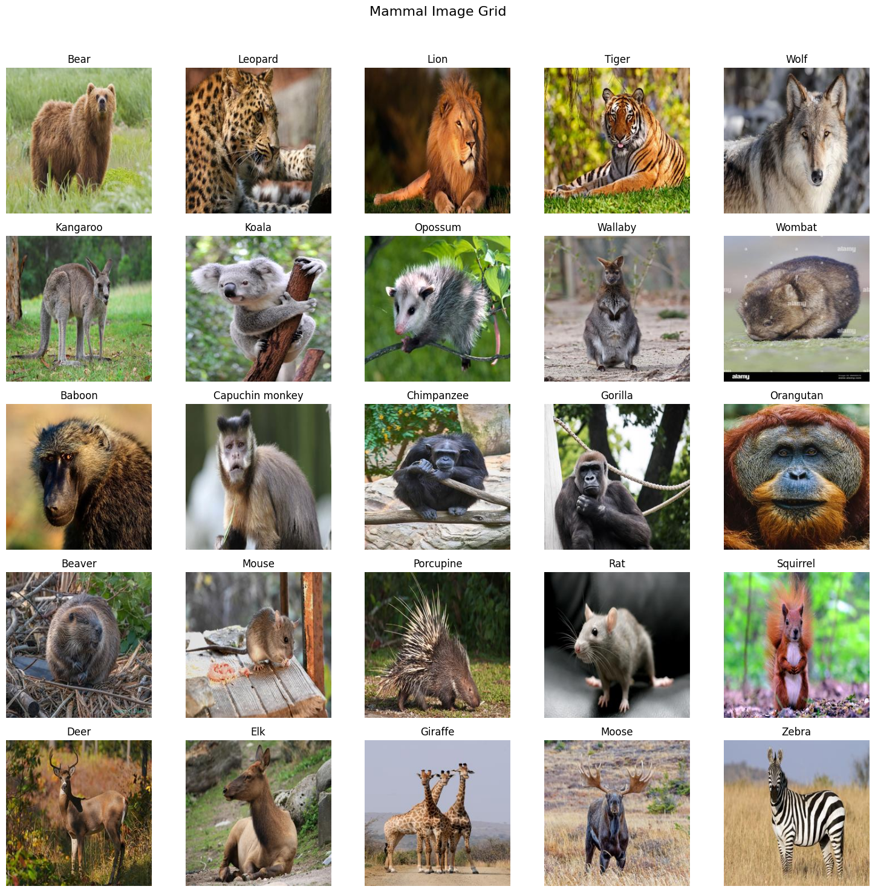
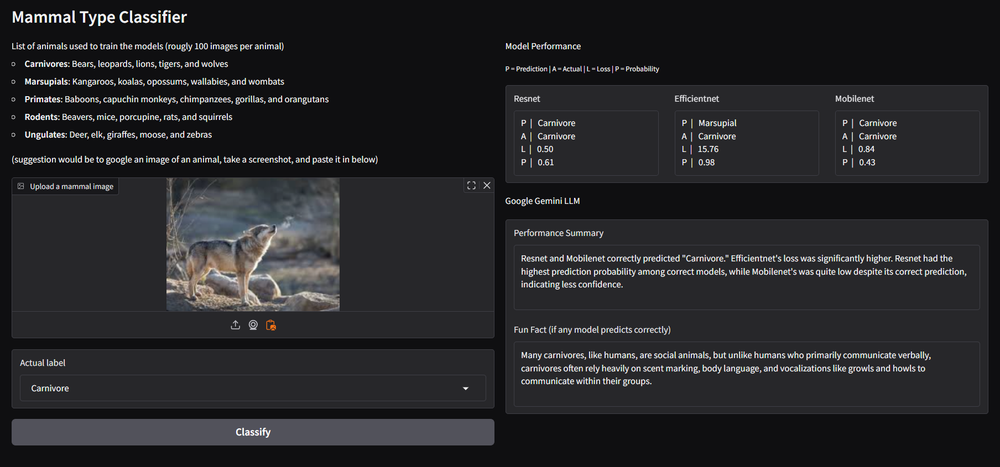

# Mammal-Type-Classifier

This repository presents an end-to-end workflow for developing a Mammal Type Classifier and deploying it as an interactive Gradio application. The model classifies animal images into one of five mammal groups: Carnivore, Marsupial, Primate, Rodent, or Ungulate. My goal with this project is to gain hands-on experience in the full machine learning pipeline—from data acquisition and preprocessing to model training, evaluation, and deployment into a user-friendly application

## Table of Contents
### Model
- Model Classification
- Model Training 

### Application
- Requirements
- Gradio Demo

## Model
### Model Classification
The model classifies an animal image into one of five mammal groups
- Carnivore
- Marsupial
- Primate
- Rodent
- Ungulate

### Model Training
For multi-model comparison I specifically used three pretrained CNNs
- [ResNet](https://en.wikipedia.org/wiki/Residual_neural_network)
- [EfficientNet](https://en.wikipedia.org/wiki/EfficientNet)
- [MobileNet](https://en.wikipedia.org/wiki/MobileNet)

## Application
### Requirements

### Gradio Demo

The application has a multi-model comparison feature, as well as a model performance, and fun fact summary generated by Gemini. a LLM created by Google

